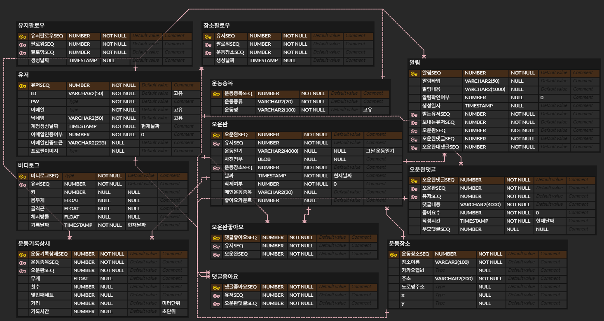
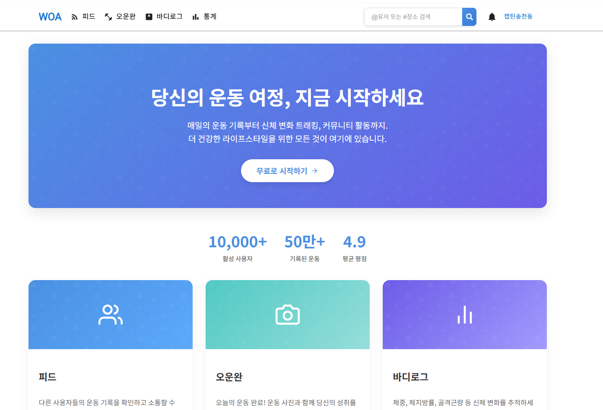
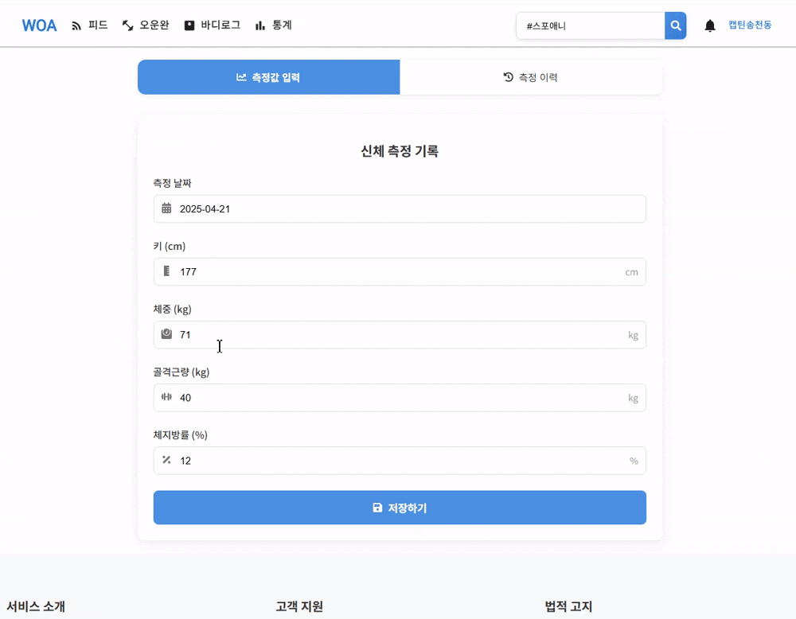
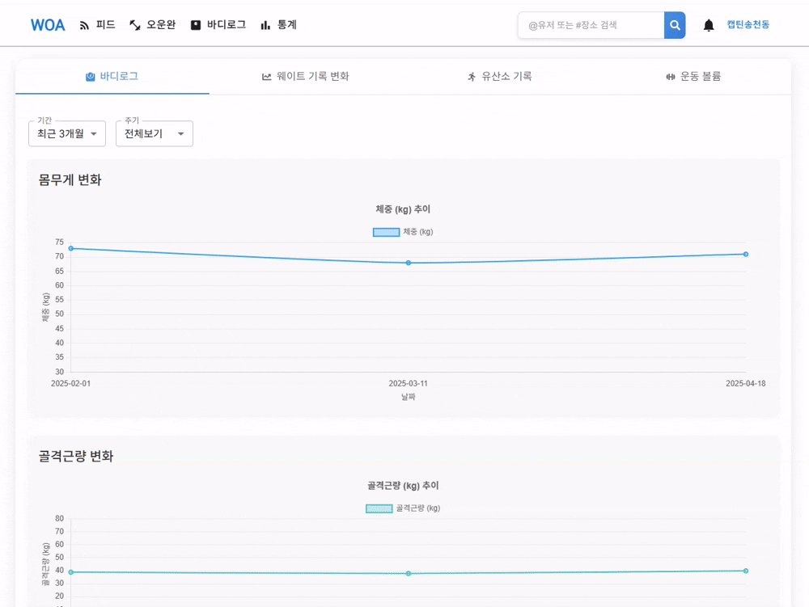

# 🏋️‍♂️ Workout Archive (Monorepo)


**Workout Archive**는 사용자가 운동 기록을 상세하게 저장하고, 다른 사용자와 공유하며 소통할 수 있는 풀스택 웹 애플리케이션입니다. 사용자 친화적인 UI/UX와 **운동 장소 기반의 소셜 네트워킹 기능**을 결합하여 운동 경험을 향상시킵니다.

---

## 📂 프로젝트 구조

본 프로젝트는 백엔드와 프론트엔드가 하나의 저장소에서 관리되는 **모노레포(Monorepo)** 구조입니다.

```text
workout-archive/
├── workout-archive-be/  # Express.js & PostgreSQL 기반 백엔드 서버
└── workout-archive-fe/  # React & Redux 기반 프론트엔드 클라이언트
```

---

## ✨ 주요 기능

- **사용자 관리:** JWT 기반 인증, bcrypt 비밀번호 암호화, 팔로우/언팔로우
- **운동 기록 관리:** 세트, 무게, 횟수 등 상세 정보 기록 (드래그 앤 드롭 순서 조정)
- **소셜 및 커뮤니티:** 팔로우 기반 피드, 댓글/대댓글, 좋아요, 실시간 알림(Socket.IO)
- **운동 장소:** 카카오맵 API 연동 장소 검색, 장소 팔로우 및 장소별 기록 모아보기
- **통계 및 시각화:** Chart.js 기반 바디로그 변화, 운동별 중량/수행능력 변화 분석
- **검색:** 사용자(`@닉네임`) 및 장소(`#장소명`) 검색 지원

---

## 📐 아키텍처 및 구현 포인트

### Backend
- **Pattern**: Controller-Service-Repository 패턴 적용
- **Security**: JWT(HttpOnly Cookie), Zod 기반 유효성 검증
- **Image Processing**: `Sharp` 라이브러리를 활용한 온디맨드 리사이징 및 캐싱
- **Scheduling**: `node-cron`을 이용한 데이터 정리 및 배치 작업

### Frontend
- **State Management**: Redux Toolkit을 통한 효율적인 전역 상태 관리
- **UI/UX**: MUI(Material-UI)와 Emotion을 활용한 디자인 시스템
- **Interaction**: 알림 클릭 시 해당 댓글로 자동 스크롤 및 포커싱 기능

---

## 📊 데이터베이스 설계 (ERD)



---

## 🔍 프로젝트 시연

### 메인 페이지


### 피드 & 오운완 작성
<p align="center">
  
  
</p>

### 주요 상호작용 (알림, 바디로그, 통계)
<p align="center">
  
  
  
</p>

---

## 🛠️ 기술 스택

| 구분 | 기술 |
| :--- | :--- |
| **Common** | `TypeScript` |
| **Backend** | `Node.js`, `Express.js`, `TypeORM`, `PostgreSQL`, `JWT`, `Socket.IO`, `Sharp`, `Zod` |
| **Frontend** | `React`, `Redux Toolkit`, `MUI`, `Emotion`, `Chart.js`, `Kakao Maps API` |

---

## 🚀 시작하기

### 1. 백엔드 실행
```bash
cd workout-archive-be
npm install
# .env 설정 및 DB 마이그레이션 확인
npm run dev
```

### 2. 프론트엔드 실행
```bash
cd workout-archive-fe
npm install
npm start
```

---

## 📫 연락처 및 링크
- **GitHub**: [HHOWI](https://github.com/HHOWI)
- **Project URL**: [https://github.com/HHOWI/workout-archive](https://github.com/HHOWI/workout-archive)

---
🙏 감사합니다.
